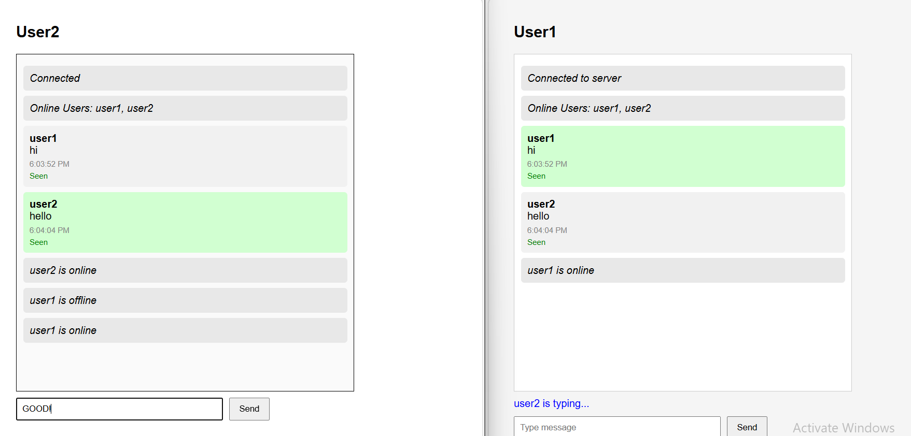

# 🚀 Realtime Chat Application

A realtime chat platform built using FastAPI, WebSockets, Redis Pub/Sub, MongoDB Atlas, and JWT Authentication.

This project focuses on solving backend engineering problems involved in realtime communication systems such as websocket connection management, distributed message broadcasting, presence synchronization, and persistent chat storage.

---

# 🌐 Live Demo

### Backend API
https://realtime-chat-nc07.onrender.com

---

# 📸 Screenshots

## 🔹 Realtime Chat Demo



Features demonstrated:
* Multi-user realtime communication
* Online/offline presence synchronization
* Typing indicators
* Seen/read receipts
* Concurrent websocket connections
* Room-based messaging
* Distributed event broadcasting

---

# ✨ Features

## ✅ Realtime Messaging
Implemented persistent bidirectional WebSocket communication for low-latency messaging between users.

## ✅ JWT Authentication
Secure websocket authentication using JWT token verification before establishing a connection.

## ✅ Redis Pub/Sub Broadcasting
Integrated Redis Pub/Sub for event broadcasting across connected websocket clients.

## ✅ MongoDB Message Persistence
Stored room-based chat history in MongoDB Atlas for persistent message retrieval.

## ✅ Presence Tracking
Implemented online/offline user tracking using Redis Sets and websocket lifecycle events.

## ✅ Typing Indicators
Realtime typing synchronization between connected users.

## ✅ Seen / Read Receipts
Implemented message seen tracking using websocket events.

## ✅ Multi-Room Communication
Supports isolated communication between multiple chat rooms.

## ✅ Async Backend Architecture
Built using FastAPI async features for handling concurrent websocket connections efficiently.

## ✅ Cloud Deployment
Deployed on Render with MongoDB Atlas integration.

---

# 🏗️ System Architecture

```text
Frontend (HTML/CSS/JS)
        │
        ▼
FastAPI WebSocket Server
        │
        ├── JWT Authentication
        │
        ├── Connection Manager
        │
        ├── Redis Pub/Sub
        │       │
        │       └── Realtime Event Broadcasting
        │
        └── MongoDB Atlas
                │
                └── Persistent Chat Storage
```

---

# 📡 Realtime Communication Flow

```text
User Sends Message
        │
        ▼
FastAPI WebSocket Endpoint
        │
        ▼
Validate JWT Token
        │
        ▼
Store Message → MongoDB Atlas
        │
        ▼
Publish Event → Redis Pub/Sub
        │
        ▼
Broadcast Event → Connected Clients
```

---

# ⚡ Scalability Considerations

* Redis Pub/Sub enables distributed event broadcasting
* Stateless backend design supports future horizontal scaling
* MongoDB indexing improves room-based message retrieval
* Async websocket handling prevents thread blocking

---

# 🛠️ Tech Stack

| Technology | Purpose |
|---|---|
| FastAPI | Backend framework |
| WebSockets | Realtime communication |
| Redis | Pub/Sub event broadcasting |
| MongoDB Atlas | Message persistence |
| JWT | Authentication |
| Render | Cloud deployment |
| Python | Backend language |
| HTML/CSS/JavaScript | Frontend |

---

# 📂 Project Structure

```text
realtime-chat/
│
├── src/
│   ├── db/
│   ├── services/
│   ├── websocket/
│   ├── models/
│   └── main.py
│
├── screenshots/
│   └── realtime-chat-demo.png
│
├── requirements.txt
├── test.html
└── README.md
```

---

# 🔐 Authentication Flow

1. User sends username to `/login`
2. Backend generates JWT token
3. Frontend connects using:

```text
wss://server/ws/{room_id}?token=JWT_TOKEN
```

4. Backend validates token
5. Secure websocket connection established

---

# 📡 Presence & Typing System

The application tracks:

* User online/offline state
* Active users per room
* Typing indicators
* Message seen status

Implemented using:

* Redis Sets
* WebSocket lifecycle events
* Connection tracking

---

# 📸 Example WebSocket Events

## Typing Event

```json
{
  "type": "typing",
  "user": "user1"
}
```

## Message Event

```json
{
  "type": "message",
  "message_id": "abc123",
  "user": "user1",
  "text": "Hello",
  "seen": false
}
```

## Seen Event

```json
{
  "type": "seen",
  "message_id": "abc123",
  "seen_by": "user2"
}
```

---

# ⚡ Engineering Concepts Demonstrated

## Backend Engineering

* Asynchronous programming
* Stateful websocket communication
* Connection lifecycle management
* Authentication & authorization
* Event-driven architecture
* Concurrent user handling

## Database & Infrastructure

* Redis Pub/Sub architecture
* NoSQL document storage
* Cloud database integration
* Realtime event synchronization

## Deployment

* Cloud deployment using Render
* Environment variable management
* MongoDB Atlas integration

---

# 🚀 Challenges Solved

## 1. Persistent WebSocket Connections

Handled concurrent websocket clients while maintaining stable bidirectional communication.

## 2. Realtime Event Broadcasting

Integrated Redis Pub/Sub to broadcast events across connected websocket clients.

## 3. Presence Synchronization

Implemented realtime online/offline tracking using Redis Sets and connection lifecycle events.

## 4. Message Persistence

Stored and restored historical chat messages using MongoDB Atlas.

---

# ▶️ Running Locally

## Clone Repository

```bash
git clone <repository-url>
cd realtime-chat
```

## Install Dependencies

```bash
pip install -r requirements.txt
```

## Start Redis

```bash
redis-server
```

## Run Backend

```bash
uvicorn src.main:app --reload
```

## Open Frontend

Run `test.html` using Live Server.

---

# 📚 Key Learnings

This project strengthened my understanding of:

* Realtime systems design
* Async backend engineering
* WebSocket lifecycle management
* Redis Pub/Sub communication
* Authentication systems
* Cloud deployment workflows

---

# 👩‍💻 About Me

Kaviya  
B.Tech Artificial Intelligence & Data Science

Interested in backend engineering, distributed systems, realtime applications, and scalable software architecture.

---

# ⭐ Conclusion

This project goes beyond traditional CRUD applications by implementing realtime communication infrastructure using WebSockets, Redis Pub/Sub, MongoDB Atlas, and asynchronous backend architecture.

It combines realtime communication, distributed event handling, persistent storage, and cloud deployment into a complete backend system.
>>>>>>> d9ab1c1 (Updated README and added realtime chat screenshots)
